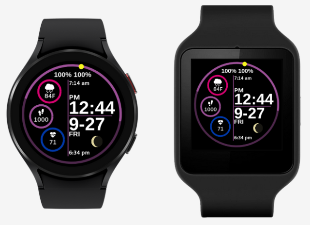
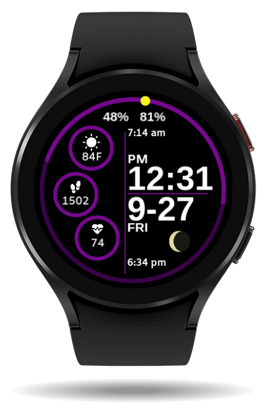
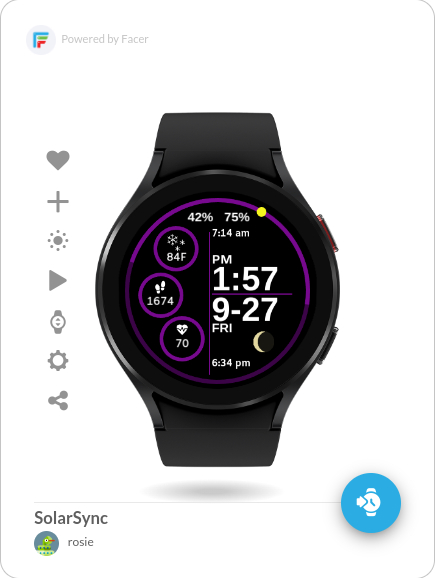
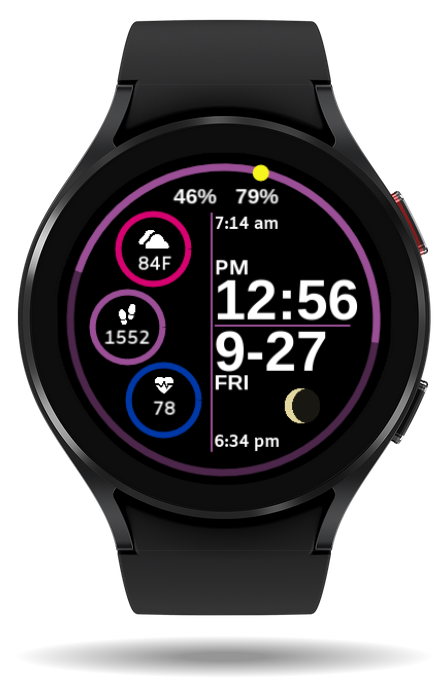
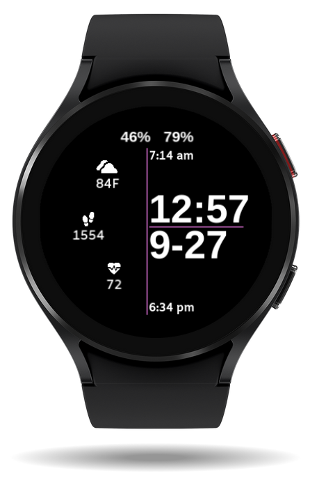
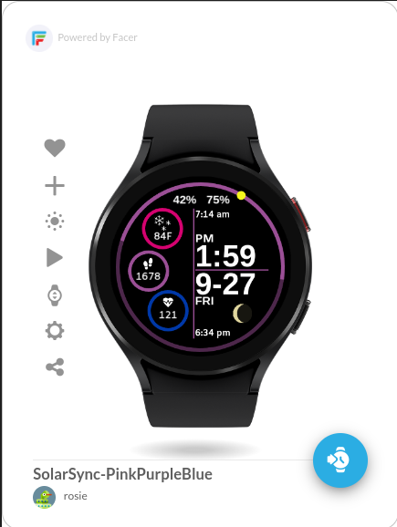

# SolarSync-watch-faces

SolarSync combines essential daily stats with natural cycles to help you stay informed throughout your day. These watch faces display sunrise and sunset times, moon phases, and the sun’s position, giving you a sense of how much daylight remains. Additionally, SolarSync displays your steps, heart rate, weather, remaining battery, and more — all in a clean and battery-efficient design.

## Description

SolarSync is designed for those who want to stay in tune with the natural rhythms of the day and their wellness. With real-time tracking of sunrise and sunset throughout the year, the position of the sun throughout the day, and the current moon phase, this watch face offers quick insights into daylight hours and nightfall. It also displays useful stats like the current weather, steps, heart rate, time, date, and remaining battery for your watch and your phone, all in a sleek, customizable interface. Whether you're planning activities, caring for outdoor animals, or navigating across seas or time zones, SolarSync helps you stay connected to the world around you and the natural cycles of day and night.

## How to Install

1. Download the [Facer](https://www.facer.io) app on your smartwatch.
2. Use the links below to sync your preferred **SolarSync** design to your device.
3. Enjoy real-time updates on your wellness and daily rhythms!

## Devices Supported

SolarSync works on both round and square watch faces for a seamless experience on various devices.

---

## SolarSync-Purple Preview

| Active | Dim / Background |
|:---:|:---:|
|  |  |

## Try SolarSync-Purple on [Facer](https://www.facer.io/watchface/kyv3b40vy1):

  

---

## SolarSync-PinkPurpleBlue Preview

| Active | Dim / Background |
|:---:|:---:|
|  |  |

## Try SolarSync-PinkPurpleBlue on [Facer](https://www.facer.io/watchface/WGaLd8kY6B):

  

---

### Tags:

- Sunrise
- Sunset
- Moon phase
- Daylight tracking
- Heart rate
- Steps
- Weather
- Time
- Date
- Watch battery
- Phone battery
- Fitness
- Sun position
- Nature
- Solar cycle
